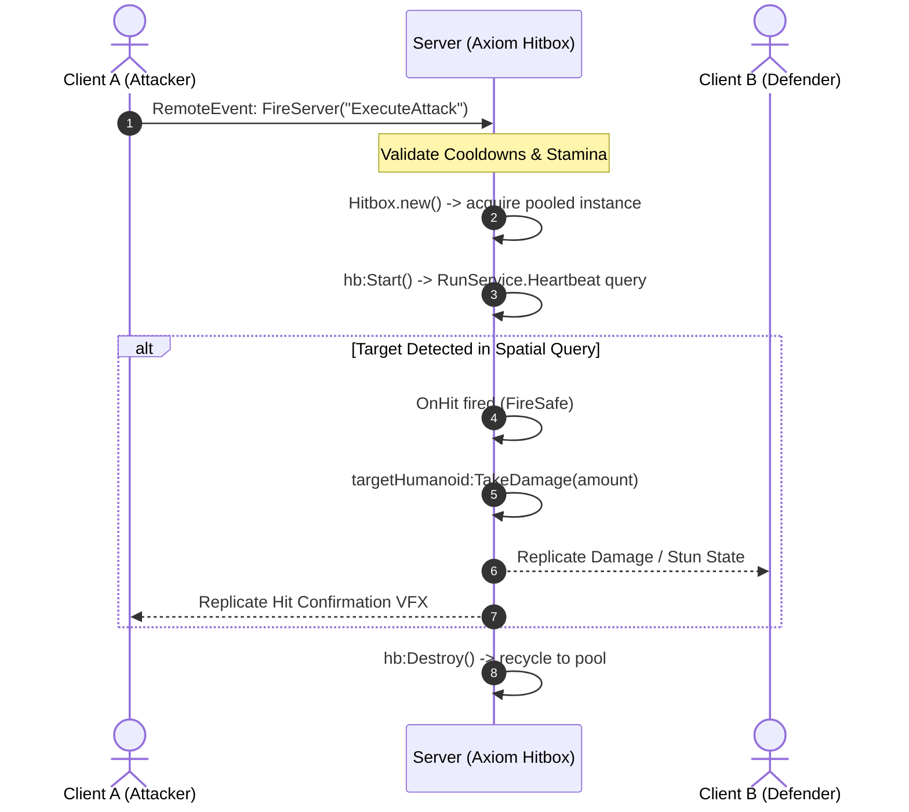

# Architecture & Authority Model

Axiom Hitbox is engineered as low-level infrastructure for server-authoritative Roblox multiplayer games.

Understanding the architectural boundaries and server authority model is critical for designing scalable combat systems.

---

## 1. Server Authority Model

In competitive multiplayer environments, **the server must remain the sole arbiter of combat resolution**.



### Server Responsibilities
- Instantiating and executing `Hitbox` spatial queries.
- Applying damage, posture depletion, and status effects.
- Managing cooldowns, stamina, and stun state machine transitions.

### Client Responsibilities
- Playing local animations and sound effects (SFX).
- Optional client-side visual previewing (using `hb.Visualizer`).
- **Never sending target hit lists to the server.**

> [!CAUTION]
> Never accept target models or hit arrays from the client over `RemoteEvents`. Clients should only send intent (e.g. `UseSkill("LightAttack")`). The server calculates spatial detection using Axiom Hitbox.

---

## 2. Infrastructure vs. Gameplay Boundary

Axiom maintains a strict separation of concerns:

| Responsibility Area | Handled by Axiom Framework? | Handled by Your Game Code? |
| :--- | :---: | :---: |
| Spatial Detection (`Box` / `Sphere`) | ✅ **YES** | ❌ NO |
| Object Pooling & Memory Stability | ✅ **YES** | ❌ NO |
| Dynamic Velocity Prediction | ✅ **YES** | ❌ NO |
| Character Access (`CharacterService`) | ✅ **YES** | ❌ NO |
| Damage Calculation & Formulas | ❌ NO | ✅ **YES** |
| Combo Counters & Stun Timers | ❌ NO | ✅ **YES** |
| Visual Effects (VFX) & Audio (SFX) | ❌ NO | ✅ **YES** |
| Skill Cooldowns & Mana Costs | ❌ NO | ✅ **YES** |

---

## 3. Performance Claims & Scope

Axiom's performance characteristics are primarily derived from reducing repeated framework-side work and allocations. The framework reuses query configuration, pooled hitbox state, internal buffers where applicable, and cached hierarchy information in performance-sensitive paths.

These techniques reduce framework-side allocation and repeated computation during sustained workloads. However, the execution cost of Roblox engine operations, including spatial queries, depends on factors such as world complexity, part count, query geometry, target count, and server workload.

Axiom therefore does not guarantee a fixed execution time such as "sub-millisecond" across all workloads.

---

## 4. Architectural Design & Overhead Reduction

To reduce framework-side memory allocation churn and engine query overhead during multi-target combat encounters, Axiom incorporates specific structural optimizations based on Luau and Roblox engine characteristics:

### A. OverlapParams Reuse
Creating and configuring `OverlapParams` instances on every query iteration allocates engine objects on the heap. Axiom creates and configures `OverlapParams` outside the repeated query path and reuses the instance (`_activeOverlap`) across queries, avoiding repeated construction of framework-owned query configuration.

### B. Fast-Path Parent Hierarchy Checks
When spatial queries return target `BasePart` instances, recursively traversing tree hierarchy using `FindFirstAncestorOfClass("Model")` can add unnecessary tree search overhead for standard character rig layouts. Axiom evaluates `part.Parent` first as a fast-path:

```lua
-- Internal Axiom optimization snippet
local parent: Instance? = part.Parent
if parent and self._hit[parent] then
    continue -- Fast-skip already processed targets
end
```

### C. Weak-Keyed Hierarchy Cache
The weak-keyed cache (`_humCache`) stores previously resolved hierarchy information, avoiding repeated `FindFirstAncestorOfClass("Model")` or child searches for parts that have already been resolved within the same attack window, while allowing entries to become collectible when their keys are no longer referenced.

### D. Object Pool State Recycling
Hitbox instances are retained in an internal pool (`_POOL`) and reused across activations, avoiding repeated construction of hitbox state and table instances during frequent combat actions.

