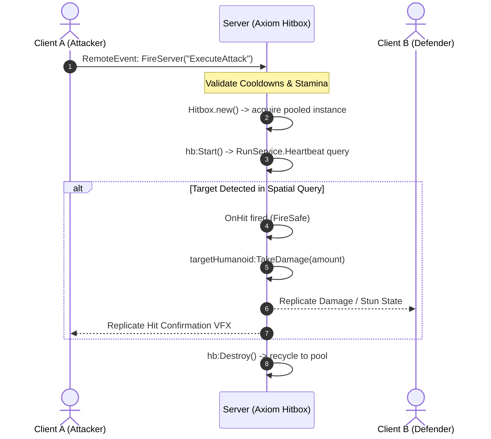

# Architecture & Authority Model

Axiom Hitbox is engineered as low-level, high-frequency infrastructure for competitive Roblox multiplayer games.

Understanding the architectural boundaries and server authority model is critical for designing scalable combat systems.

---

## 1. Server Authority Model

In competitive multiplayer environments, **the server must remain the sole arbiter of combat resolution**.



### Server Responsibilities
- Instantiating and executing `Hitbox` spatial queries.
- Applying damage, posture depletion, and status effects.
- Managing cooldowns, stamina, and stun state machine transitions.

### Client Responsibilities
- Playing local animations and sound effects (SFX).
- Optional client-side visual previewing (using `hb.Visualizer`).
- **Never sending target hit lists to the server.**

> [!CAUTION]
> Never accept target models or hit arrays from the client over `RemoteEvents`. Clients should only send intent (e.g. `UseSkill("LightAttack")`). The server calculates spatial detection using Axiom Hitbox.

---

## 2. Infrastructure vs. Gameplay Boundary

Axiom maintains a strict separation of concerns:

| Responsibility Area | Handled by Axiom Framework? | Handled by Your Game Code? |
| :--- | :---: | :---: |
| Spatial Detection (`Box` / `Sphere`) | ✅ **YES** | ❌ NO |
| Object Pooling & Memory Stability | ✅ **YES** | ❌ NO |
| Dynamic Velocity Prediction | ✅ **YES** | ❌ NO |
| Character Access (`CharacterService`) | ✅ **YES** | ❌ NO |
| Damage Calculation & Formulas | ❌ NO | ✅ **YES** |
| Combo Counters & Stun Timers | ❌ NO | ✅ **YES** |
| Visual Effects (VFX) & Audio (SFX) | ❌ NO | ✅ **YES** |
| Skill Cooldowns & Mana Costs | ❌ NO | ✅ **YES** |

---

## 3. Hot-Path Optimization Rules

To guarantee low latency during high-player combat encounters (e.g. 50+ hitboxes active simultaneously on 60 FPS servers), Axiom applies strict internal optimization rules:

### A. Zero-Allocation `OverlapParams`
In standard Roblox code, calling `OverlapParams.new()` every frame allocates heap memory and triggers Garbage Collection (GC) spikes. Axiom allocates internal `_activeOverlap` buffers once and mutates properties in-place per activation.

### B. Fast-Path Ancestry Checks
When `workspace:GetPartBoundsInBox` returns hit parts, traversing ancestry with `FindFirstAncestorOfClass("Model")` is expensive. Axiom checks `part.Parent` fast-path first:

```lua
-- Internal Axiom optimization snippet
local parent: Instance? = part.Parent
if parent and self._hit[parent] then
    continue -- Fast-skip already processed targets
end
```

### C. Weak Humanoid Caching
Each `Hitbox` instance maintains a weak-keyed `_humCache` metatable (`__mode = "k"`). Once a `Humanoid` reference is discovered for a target `Model`, subsequent lookups operate in $O(1)$ time without child searching.

### D. $O(1)$ Pool Management
The internal `Pool.luau` tracks active and available instances using an integer counter (`_inUseCount`), avoiding table iterations during allocation or release.
