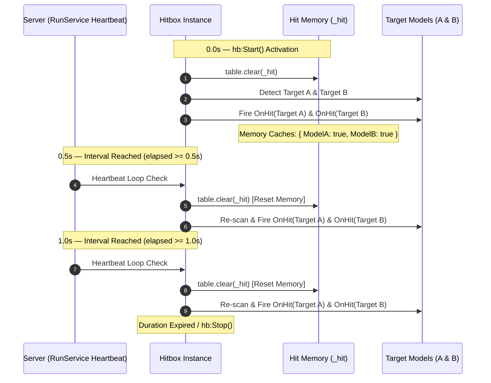

# Continuous & Channeling Attacks

By default, an Axiom `Hitbox` records every target `Model` it strikes in an internal hit memory buffer (`_hit`) and fires `OnHit` **exactly once per model per activation**.

For continuous skills—such as spin attacks, flamethrowers, laser beams, or damage-over-time (DoT) auras—you need the hitbox to hit the same target repeatedly at regular intervals.

Axiom Hitbox v1.4.0 introduces the **`HitResetInterval`** property to handle continuous channeling natively.

---

## 1. Using `HitResetInterval`

Setting `HitResetInterval` to a positive number (seconds) automatically resets the internal hit memory buffer whenever the specified time interval elapses:

```lua
local hb = Hitbox.new()
hb.Shape = "Sphere"
hb.Radius = 10
hb.CFrame = character.HumanoidRootPart
hb.Duration = 5.0 -- Active for 5 seconds total

-- Reset hit memory every 0.5 seconds (deals damage 2x per second)
hb.HitResetInterval = 0.5

hb.Ignore = { character }

hb.OnHit:Connect(function(targetModel: Model, targetHumanoid: Humanoid, hitPart: BasePart)
    print(`[Channeling] Ticked damage on {targetModel.Name}`)
    targetHumanoid:TakeDamage(10)
end)

hb:Start()
```

---

## 2. Execution Mechanics



1. On `:Start()`, `_lastHitReset` is set to 0 and `_hit` is cleared.
2. During each `Heartbeat` frame, Axiom checks if `elapsed - lastHitReset >= HitResetInterval`.
3. If the threshold is reached, `table.clear(_hit)` is executed in $O(1)$ time, allowing targets currently inside the hitbox bounds to register another `OnHit` event.

---

## 3. Common Use Cases & Presets

### Spin Attacks / Whirlwinds
```lua
hb.Duration = 2.0
hb.HitResetInterval = 0.25 -- 4 hits per second
```

### Flamethrowers & Beam Weapons
```lua
hb.Duration = 3.0
hb.HitResetInterval = 0.1 -- 10 hits per second (rapid tick damage)
```

### Passive Aura Damage
```lua
hb.Duration = 10.0
hb.HitResetInterval = 1.0 -- 1 hit per second
```
