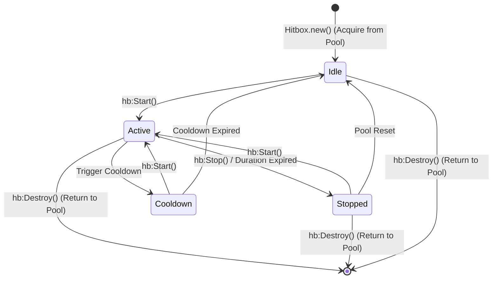

# Hitbox Lifecycle & Finite State Machine

Every `Hitbox` instance in Axiom operates under an explicit finite state machine.

This lifecycle ensures deterministic execution, eliminates dangling `RunService` loops, and powers automatic memory pooling.

---

## 1. State Transition Diagram

The state machine (`src/Axiom/Hitbox/State.luau`) supports 4 distinct states:



---

## 2. State Breakdown

### `Idle`
- Initial state upon acquisition from `Hitbox.new()`.
- Detection loop is **inactive**.
- No `RunService.Heartbeat` connections active.
- Safe to mutate configuration properties (`Size`, `CFrame`, `Duration`, `Ignore`, etc.).

### `Active`
- Entered when `:Start()` is invoked.
- `OnStart` signal is emitted (`FireSafe`).
- Binds to `RunService.Heartbeat`.
- Spatial detection queries execute every frame.
- Visualizer part (if `hb.Visualizer = true`) is updated in `workspace`.

### `Stopped`
- Entered when `:Stop()` is invoked or `hb.Duration` expires.
- `OnStop` signal is emitted.
- `RunService.Heartbeat` connection is disconnected.
- Visualizer part is hidden (`Parent = nil`).
- Can safely transition back to `Active` via `:Start()` or return to pool via `:Destroy()`.

### `Cooldown`
- State representation for custom cooldown routines.
- Allows transitions back to `Idle` or `Active`.

---

## 3. Lifecycle Methods

### `Hitbox.new()`
```lua
local hb = Hitbox.new()
```
Acquires a clean `Hitbox` instance from the global adaptive pool `_POOL`. Properties are reset to defaults, and the state is set to `Idle`.

---

### `hb:Start()`
```lua
hb:Start()
```
- Validates that the instance has not been destroyed.
- Transitions state from `Idle`/`Stopped`/`Cooldown` -> `Active`.
- Copies `OverlapParams` and `Ignore` table references into `_activeOverlap`.
- Emits `hb.OnStart(hb)`.
- Connects to `RunService.Heartbeat`.

---

### `hb:Stop()`
```lua
hb:Stop()
```
- Transitions state to `Stopped`.
- Disconnects internal `Heartbeat` connection.
- Hides the visualizer part.
- Emits `hb.OnStop(hb)`.

---

### `hb:Destroy()`
```lua
hb:Destroy()
```
- Sets internal flag `_destroyed = true`.
- Disconnects all signal listeners (`OnHit`, `OnStart`, `OnStop`, `OnUpdate`).
- Destroys visualizer part instance.
- Releases the object back to the adaptive pool `_POOL`.

> [!IMPORTANT]
> **Post-Destroy Invariant**: Do NOT use a `Hitbox` reference after calling `:Destroy()`. Using a destroyed reference will log a warning and block activation.

---

## 4. State Query API

You can inspect the state of a hitbox instance at runtime using non-mutating query methods:

```lua
-- Get state string ("Idle", "Active", "Stopped", "Cooldown")
local currentState: string = hb:GetState()

-- Check if hitbox is in a specific state
if hb:Is("Active") then
    print("Hitbox is currently scanning")
end

-- Helper shortcut for active state check
if hb:IsActive() then
    -- ...
end
```
