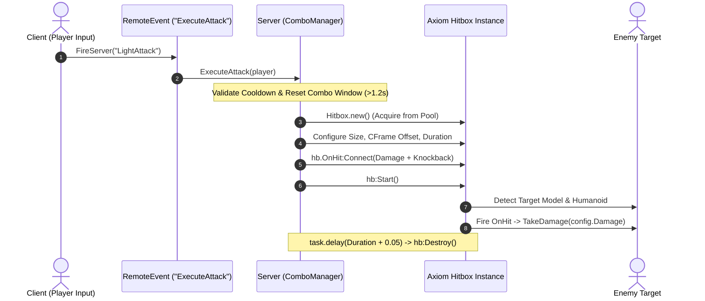

# Building a Melee Combat System

This guide demonstrates how to construct a robust, server-authoritative 3-hit combo melee combat system using Axiom Hitbox and Axiom Core primitives.

---

## Architecture Pattern



---

## Full Implementation Code

```lua
local ReplicatedStorage = game:GetService("ReplicatedStorage")
local Axiom = ReplicatedStorage:WaitForChild("Axiom")
local Hitbox = require(Axiom.Hitbox)
local Await = require(Axiom.Core.Await)

local ComboManager = {}
ComboManager.PlayerData = {}

-- Combo Configuration
local COMBO_DATA = {
    [1] = { Damage = 10, Size = Vector3.new(4, 5, 4), Duration = 0.2, Stun = 0.4 },
    [2] = { Damage = 12, Size = Vector3.new(4, 5, 4), Duration = 0.2, Stun = 0.4 },
    [3] = { Damage = 25, Size = Vector3.new(6, 6, 6), Duration = 0.35, Stun = 0.8, Knockback = 40 },
}

function ComboManager.ExecuteAttack(player: Player)
    local character = player.Character
    if not character or not character:FindFirstChild("HumanoidRootPart") then return end

    local userId = player.UserId
    local data = ComboManager.PlayerData[userId] or { Step = 1, LastAttack = 0 }
    
    local now = os.clock()
    if now - data.LastAttack > 1.2 then
        data.Step = 1 -- Reset combo sequence if player waited too long
    end

    local config = COMBO_DATA[data.Step]
    data.LastAttack = now

    -- 1. Acquire Hitbox
    local hb = Hitbox.new()
    hb.Shape = "Box"
    hb.Size = config.Size
    hb.CFrame = character.HumanoidRootPart
    hb.Offset = CFrame.new(0, 0, -3.5)
    hb.Duration = config.Duration
    hb.Ignore = { character }

    -- 2. Connect Hit Logic
    hb.OnHit:Connect(function(targetModel: Model, targetHumanoid: Humanoid, hitPart: BasePart)
        -- Deal damage
        targetHumanoid:TakeDamage(config.Damage)
        
        -- Apply knockback on finisher
        if config.Knockback and targetModel:FindFirstChild("HumanoidRootPart") then
            local root = targetModel.HumanoidRootPart :: BasePart
            local moveDir = character.HumanoidRootPart.CFrame.LookVector
            root:ApplyImpulse(moveDir * config.Knockback * root:GetMass())
        end
    end)

    -- 3. Execute Hitbox
    hb:Start()

    -- Advance combo step
    data.Step = (data.Step % #COMBO_DATA) + 1
    ComboManager.PlayerData[userId] = data

    -- 4. Clean up after duration
    task.delay(config.Duration + 0.05, function()
        hb:Destroy()
    end)
end

return ComboManager
```
