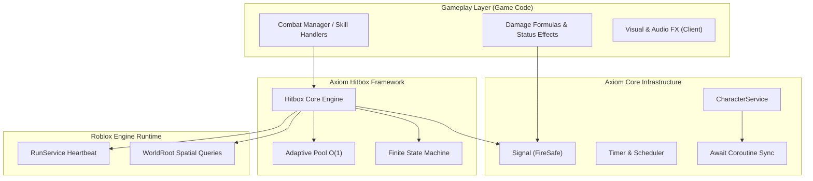

## ⚡ Quick Code Sample

```lua
local Axiom = game.ReplicatedStorage:WaitForChild("Axiom")
local Hitbox = require(Axiom.Hitbox)

-- Acquire pooled instance (O(1) allocation)
local hb = Hitbox.new()
hb.Shape = "Box"
hb.Size = Vector3.new(6, 6, 6)
hb.CFrame = character.HumanoidRootPart
hb.Offset = CFrame.new(0, 0, -3)
hb.Duration = 0.25
hb.Ignore = { character }

-- Synchronous exception-safe event connection
hb.OnHit:Connect(function(model, humanoid, part)
    humanoid:TakeDamage(25)
end)

-- Activate detection
hb:Start()

-- Recycle back to adaptive pool when finished
hb:Destroy()
```

---

## 🧭 Architecture Overview

Axiom separates **infrastructure primitives** from **gameplay logic**.



- **Infrastructure First**: Combat rules, damage multipliers, combos, and animations live in your game code. Axiom handles spatial queries, timing, pooling, and synchronization.
- **Server Authority**: Combat detection executes on the server. Clients may run local hitboxes for visual feedback or prediction only.
- **Deterministic Cleanup**: Explicit lifecycle methods (`Start`, `Stop`, `Destroy`) ensure no hanging connections or memory leaks.

---

## 📦 Ready to Install?

Check out our [Installation Guide](/getting-started/installation) to set up Axiom in your Roblox Studio project using the Roblox Creator Store package or packaged GitHub Releases.
